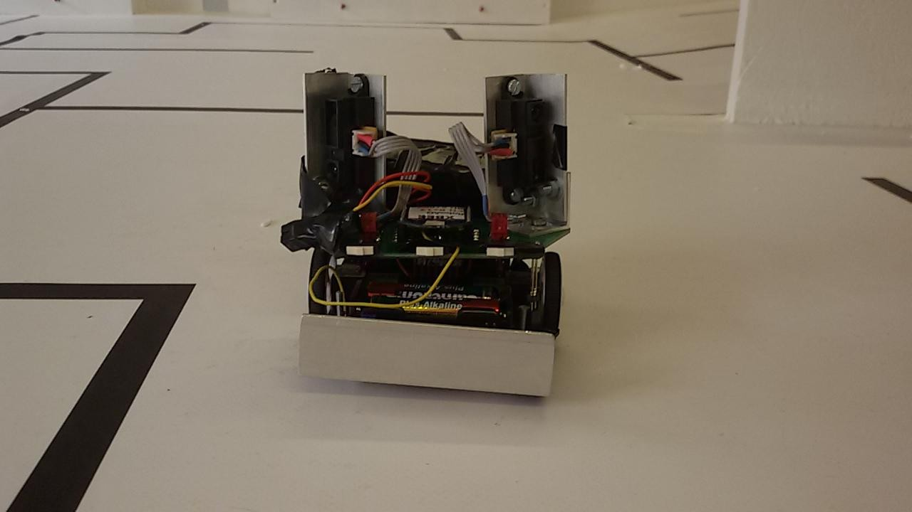

# RoboSAX 2017-2018

### Team
+ Janek Neugebauer
+ Leonhard Nagel
+ Christoph Männel
+ Felix Krüger

### Aufgabenstellung
Siehe [RoboSAX Webseite](https://robosax.de/2018).

### Roboter

## 1. Grobes Konzept
Unsere Idee war es Zeit zu sparen, indem der Roboter an der Wand entlang fährt, was die Strecke von Taster zu Taster reduziert. Die Taster werden durch die schwarzen Linien an den Tastern entdeckt. Sollte kein Infrarotsignal an einem Taster entdeckt werden, dann dreht sich der Roboter um 90°, fährt nach vorne, drückt den Taster, dreht sich um 180°, fährt nach vorne, dreht sich um 90° und fährt weiter. Eine Überprüfung nach diesem Prozess findet nicht statt, da er so zuverlässig ist.

## 2. Hardware
Wir sind von einem normalen 3pi ausgegangen und haben einige Sensoren hinzugefügt:

+ Sharps (Infrarot-Abstandssensoren)
Die Sharps waren ausschließlich dazu da, die Entfernung zu den Wänden zu messen. Diese wurden mit einer Platine aus Eigenbau verbunden und gaben zwei Analogwerte aus. Diese wurden von zwei AD-Wandlern verarbeitet. Damit sind alle freien AD-Wandler des 3Pi besetzt.  
Siehe auch: [GP2Y0A21YK0F-KIT](https://www.reichelt.de/distanzsensor-10-80-cm-analog-gp2-1080k-p114322.html) und [git-Repository](https://github.com/RoboAG/eagle_xbee/tree/master/p3pi)

+ Infrarotdiodensensor
Der Infrarotdiodensensor war nichts mehr als ein Bodensensor ohne Infrarotdiode. Wir brauchten keinen weiteren AD-Wandler, da wir das große Glück hatten, dass bei einer eingeschalteten Infrarotdiode wir eine Spannung von etwa 4 Volt hatten, und bei einer nicht-eingeschalteten Infrarotdiode eine Spannung von etwa 1,5 Volt hatten. Wir haben diesen Sensor eingebaut, indem wir den Buzzer entfernt haben.  
Siehe auch: [CNY70](https://www.reichelt.de/optokoppler-cny-70-p6683.html)

## 3. Software
+ Konstanter Abstand zu Wänden halten
Das wird durch einen 5-Punkt-Regler realisiert.
Siehe Funktion motoransteuerung()

+ Es wurde auch ein Konzept mit einem P-Regler statt dem 5-Punkt-Regler geplant, aber nie fertiggestellt.
Siehe Ordner V3.0

+ 90° drehen
Eine einfache Angabe der Zeit, wie lange sich der Roboter drehen muss. Diese Zeit wurde experimentell ermittelt.
Siehe int dreh = 375; # Zeit in ms

+ Debugging
Wir haben sowohl das Display, die Leds und das Xbee-Modul benutzt. Das Xbee-Modul wurde im RoboSAX nicht benutzt.
